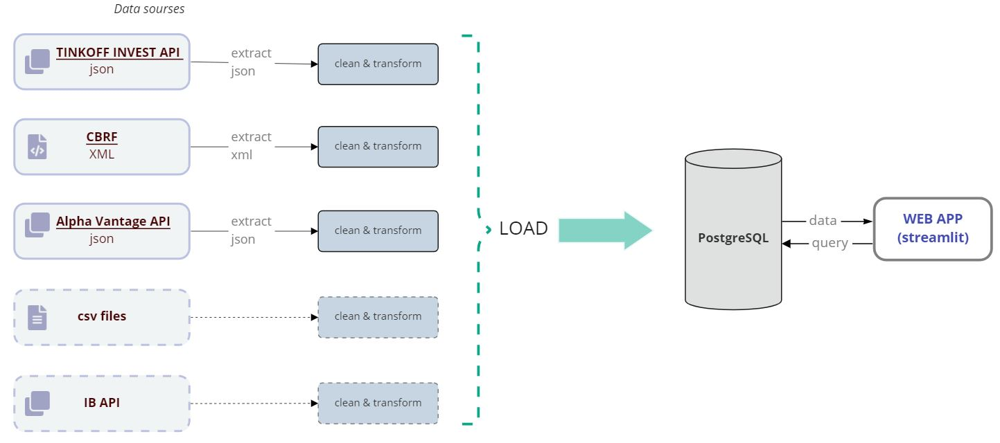
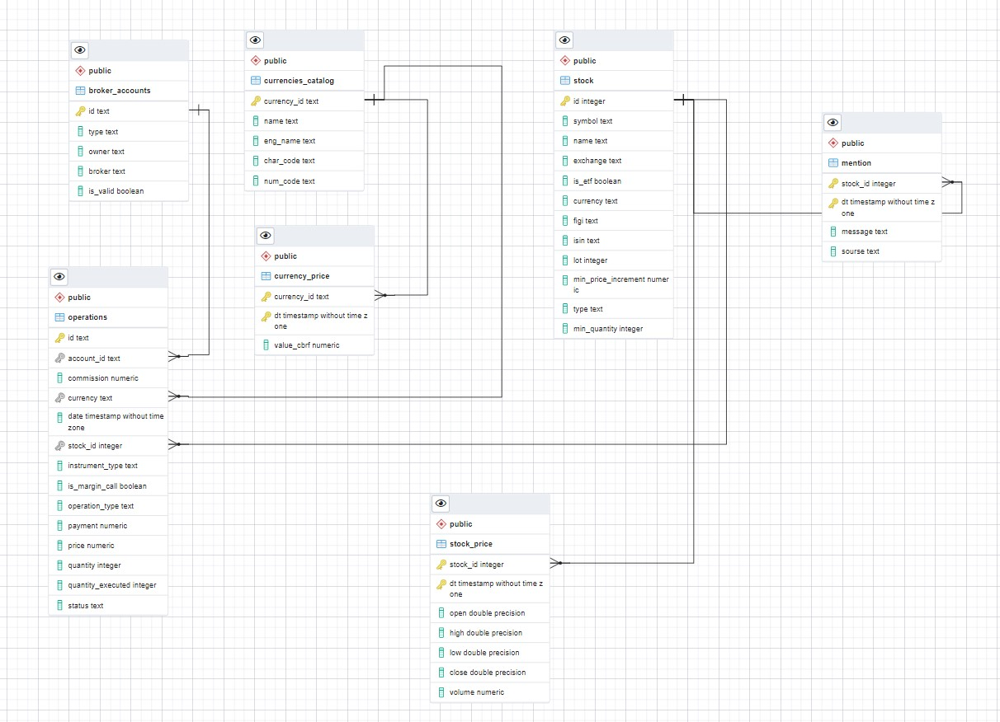
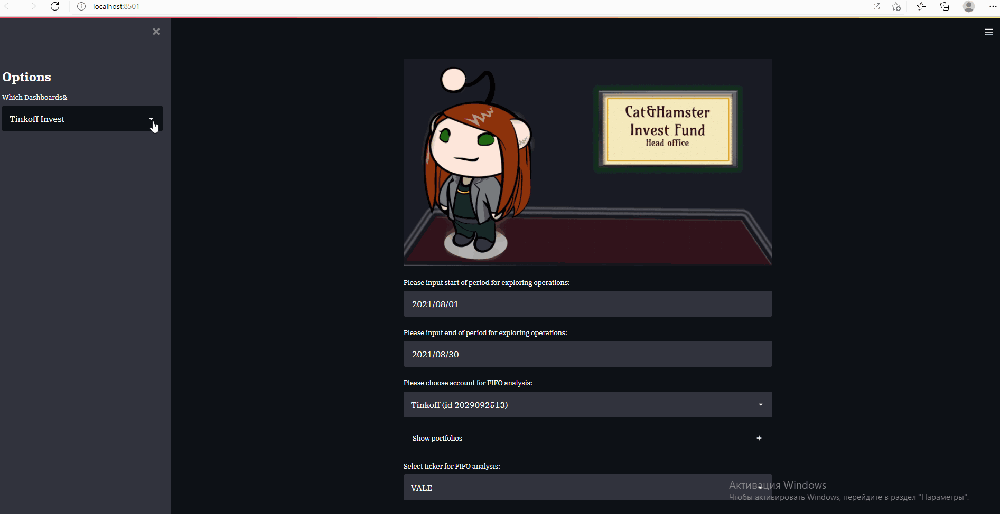

# Project Title

A brief description of what this project does and who it's for

## Навигация
* [Инструменты](#инструменты)
* [Источники данных](#источники-данных)
* [Features](#features)
* [Дополнительно](#дополнительно)
* [ROADMAP](#roadmap)
* [DEMO](#demo)
* [Private settings](#private-settings)
* [Deployment](#deployment)

(<a href="#readme-top">back to top</a>)

## Инструменты

- UI: streamlit==1.20.0 
- Python 3.9
- PostgreSQL 14
- Apache Superset 
- Docker
- Apache Airflow (soon ...)

(<a href="#readme-top">back to top</a>)

## Источники данных

- Alpha Vantage API  - [документация](https://www.alphavantage.co/documentation/)  
    Квартальные и годовые отчеты по эмитентам
- Tinkoff Invest API  - [документация](https://tinkoff.github.io/investAPI/swagger-ui/#/)    
    рыночные цены, операции по счету
- сайт ЦБ РФ  - [документация](https://cbr.ru/development/SXML/)  
    валютные курсы по ЦБ РФ на дату
- отчеты других брокеров в формате csv

(<a href="#readme-top">back to top</a>)

## Features

- ...
- ...

(<a href="#readme-top">back to top</a>)

## Дополнительно 
ERD диаграмма базы данных

(<a href="#readme-top">back to top</a>)

## Roadmap

- [x] Add something ...
- [ ] Add something else ...
    - [ ] and more ...

(<a href="#readme-top">back to top</a>)

## Demo

Insert gif or link to demo

(<a href="#readme-top">back to top</a>)

## Private settings

To run this project, you will need to add the following variables to your config.py file

Для подключения к базе данных:  
`DB_HOST` = ""  
`DB_USER` = ""  
`DB_PASS` = ""  
`DB_NAME` = ""  

Alpha Vantage API token:  
`AV_KEY` =  

Tinkoff Invest API token:  
`TCS_API_token`= ""  
`TCS_API_2_token` = ""  

(<a href="#readme-top">back to top</a>)

## Deployment

To deploy this project ...

*Редактируется...*

(<a href="#readme-top">back to top</a>)
